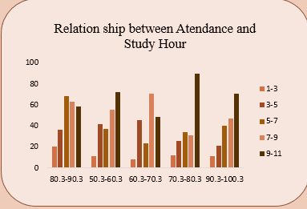
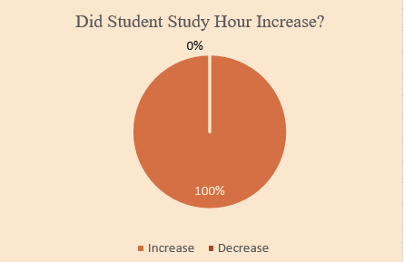
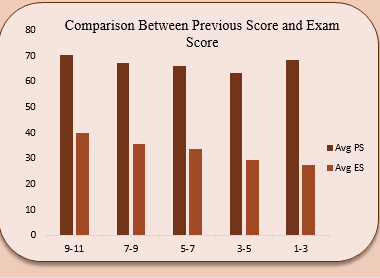
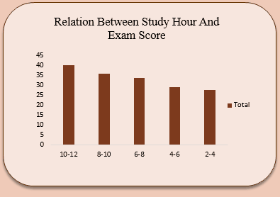
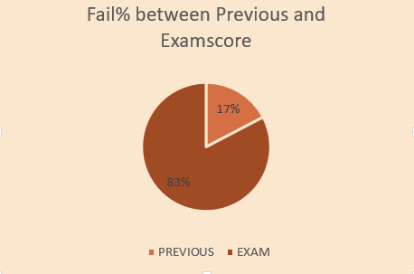
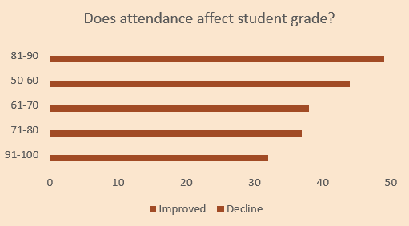

# STUDENT EXAM SCORE ANALYSIS  
This project analyzes student performance using Excel, Pivot Tables, and Pivot Charts.

*Portfolio Project by **Ambali Ayishat (Data Analyst)**  
---

## 1 INTRODUCTION
In Education an Examination is a formal test to measure the knowledge and ability of students, promote learning, and certify competence. However, the performance data from this analysis reveals a concerning trend: despite increased study efforts, students performed significantly worse in their latest exams compared to previous assessments.
---

## DATA SET DESCRIPTION
The dataset contains the following variables:
- Student_Id
- Hours_Studied
- Hours_Studied2
- Attendance_Percent
- Previous_Scores
- Exam_Score
- Attendance
---

## 3. Objectives
The analysis aims to answer the following questions:
- What is the relationship between attendance and study hours?
- Did students increase their study hours for the exam?
- How do previous scores compare to exam scores?
- What is the relationship between study hours and exam performance?
- What percentage of students failed previously vs. in the exam?
- Does attendance affect student grades?
---

## 4. Tools Used
**EXCEL**  
**PIVOT TABLE**  
**PIVOT CHART**
---

## 5. EXCEL Analysis & Insights
 
 ### A. Relationship between Atendance and Study Hour?

Students studied the most for 9–11 hours, which is consistent across attendance levels of 50–60%, 70–80%, and 90–100% and third common across attendance level of 60-70% and 80-90%. The next most common study duration was 7–9 hours, particularly among students with 60–70% attendance, followed by those within 80–90%, 50–60%, and 90–100% attendance levels. The least common study durations were 1–3 hours and 3–5 hours across all attendance categories.

---

### B. Did Student Study Hour Increase?

Students increased their study hours for the exam compared to their previous reading time. This implies that the decline in student performance during the exam was not due to reduced study hours

---

###  C. Comparison Between Previous Score and Exam Score?

- The highest average previous score was 70.4, recorded by students who studied for 9–11 hours.
- while the highest exam score average was 43.1, achieved by students who studied for 11–13 hours. 
- As study hours decreased, exam scores also declined:
    -  11–13 → 43.1
    -  1–3 → 27.5.
This indicates that longer study hours were linked to better performance; although overall exam scores remained low.

---
### D. Relation Between Study Hour And Exam Score?

- 12–14 hours → 44.1
- 10–12 hours → 40.1
- 8–10 hours → 35.7
- 6–8 hours → 33.5
- 4–6 hours → 22.2
- 2–4 hours → 27.5
This further supports a positive relationship between time spent studying and exam performance.

---
### E.  Fail% between Previous and Examscore?

The Analysis highlights the difference in the *percentage of students who failed previously versus those who failed in the latest exam*
A higher failure rate was observed in the exam compared to previous assessments.

---
### F. Does attendance affect student grade? 

The data shows that students with 81–90% attendance recorded the highest number of failures (49 students).
This was followed by:
- 50–60% → 44 students
- 61–70% → 38 students
- 71–80% → 37 students
- 91–100% → 32 students
Higher attendance did not guarantee better performance.

 
 
 
---

## 6. Key Insights & Conclusion
- Most students studied for at least 7–11 hours.
- Attendance had no significant impact on study hours.
- Students performed better previously than in their exams.
- Higher attendance did not guarantee better performance.
-Longer study hours were associated with higher exam scores, but the overall decline shows other factors affected results.
- Hours spent studying had a positive effect on overall performance, but other factors likely affected exam outcomes.
- The decline in exam performance was not caused by a reduction in study hours.
